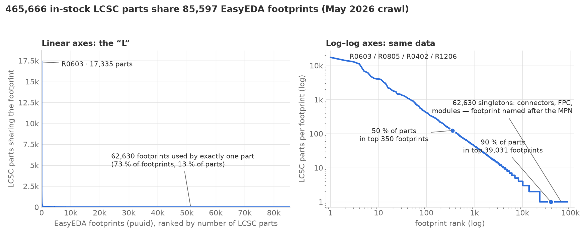

# JLCPCB rotations: the rabbit hole

*Companion to [Why are my parts rotated wrong at JLCPCB?](jlc-rotations). That
page is the short version. This one is the working notes: how the question was
investigated, what turned out to be wrong, what the data actually looks like,
and the numbers from crawling the catalog. It is condensed from a series of
scoping/checkpoint documents written during the investigation (April–June 2026),
lightly edited; where something is a guess it says so.*

## 1. How it started

The [Bouni kicad-jlcpcb-tools](https://github.com/Bouni/kicad-jlcpcb-tools)
plugin has a "Corrections" manager: a table of regexes on footprint name →
rotation (and X/Y offset), applied at CPL export. It descends from matthewlai's
JLCKicadTools `rotations.cf`. In April 2026 I fixed a matching bug in it
(specific patterns were being shadowed by substrings — `^SOT-23` also matches
`SOT-23-6`), answered
[issue #750](https://github.com/Bouni/kicad-jlcpcb-tools/issues/750) with the
usual "JLC thinks a SOT-23's pin 3 points west, KiCad thinks east, add a 180°
correction" screenshots, and then wondered: JLC's own DFM viewer *knows* the
right answer for every LCSC part. Where does it get it? Is there an API? That
became
[issue #752, "Down the rabbit hole"](https://github.com/Bouni/kicad-jlcpcb-tools/issues/752).

The arc, compressed:

1. Hypothesis: JLC's Windows app (JLCOne) must call a per-component rotation
   API. (Not confirmed; deferred — see §9.)
1. Found the EasyEDA per-component API and its `c_rotation` field on the
   3D-model node. Hypothesis: `c_rotation_Z` *is* the JLC correction.
1. Falsified as data accumulated: multiple parts where `c_rotation_Z` and the
   observed JLC offset differ. It's 3D-model render metadata, decorrelated from
   tape orientation.
1. Recognised that EIA-481 (the SMT tape standard) predicts the *family-level*
   pattern of corrections.
1. Built a 56-part test board across the common package families and read the
   true offsets off JLC's DFM viewer.
1. Found the EasyEDA Footprint Naming Rule and realised the orientation is
   encoded in the footprint *name*.
1. Split two-pin polarized parts into two distinct failure modes (§6), one of
   which "works by accident."
1. Crawled the in-stock catalog to measure how far the naming rule + geometry
   actually reach (§7).

## 2. One company, one metadata pool

LCSC (distribution), JLCPCB (fab + assembly), EasyEDA (EDA), and OSHWLAB
(sharing) are all 嘉立创 / JLC Group and share engineering infrastructure. The
[EasyEDA Footprint Naming Rule Reference](https://docs.easyeda.com/en/PCBLib/PCBLib-Naming-Rule/index.html)
([PDF](https://image.easyeda.com/files/EasyEDA+Footprint+Naming+Rule+Reference.pdf),
MIT-licensed, 84 pages) was jointly authored by LCSC's engineering department
and the EasyEDA team. That matters: it's *internal engineering documentation of
the assembly pipeline*, not a third-party convention. When it says `-FD` means
"polarity left-to-right," that's the same organisation's understanding that
drives the pick-and-place line.

The inference I keep making — and can't prove — is that the DFM/placement
preview after upload renders the EasyEDA footprint + 3D model for each LCSC
number, and the pink pin-1 dot is EasyEDA's pin 1. Every observation so far is
consistent with that (per-footprint consistency of corrections; the TVS-diode
case in the main article, where the preview's discrepancy matches the EasyEDA
metadata exactly; other users' "whatever EasyEDA would do is what JLC expects").

## 3. The naming rule

Footprint names have the shape `FAMILY_dimensions-orientation`. The dimensional
tokens are documentation only: `L`/`W` body length/width, `LS` lead span, `P`
pitch, `BD` body diameter, `EP` exposed pad, `H` height. The orientation tokens
are the payload:

| Token                   | Meaning                                                                             | Applies to                   |
| ----------------------- | ----------------------------------------------------------------------------------- | ---------------------------- |
| `-FD` / `-RD` / `-BI`   | Forward / Reverse direction / Bidirectional (polarity left→right, right→left, none) | two-terminal polarized parts |
| `-TL` `-TR` `-BL` `-BR` | pin 1 at Top-Left / Top-Right / Bottom-Left / Bottom-Right                          | multi-pin packages           |
| `-L` `-R` `-T` `-B`     | pin 1 left / right / above / below the origin                                       | single-axis cases            |

Examples, with the correction *relative to a KiCad footprint drawn to KiCad
library conventions* (pin 1 top-left, + on pin 1 for caps, K on pin 1 for
diodes):

| Name                                 | Reads as                                 | KiCad correction                            |
| ------------------------------------ | ---------------------------------------- | ------------------------------------------- |
| `CAP-SMD_BD6.3-L6.6-W6.6-FD`         | polarized cap, forward                   | 0°                                          |
| `CAP-SMD_BD6.3-L6.6-W6.6-LS7.2-R-RD` | same cap, pin 1 right of origin, reverse | 180°                                        |
| `SOIC-8_L4.9-W3.9-P1.27-LS6.0-BL`    | SOIC-8, pin 1 bottom-left                | 90°                                         |
| `LED0603-RD`                         | LED, reverse                             | 0° — LEDs *invert* relative to caps, see §6 |
| `SMF_L2.8-W1.8-LS3.7-RD`             | SMF diode, reverse, pin 1 = K            | 0°                                          |

The mapping used in practice: pin-1 corner `TL→0, TR→270, BL→90, BR→180`,
single-axis `L→0, R→180, T→270, B→90`; polarity `FD→0, RD→180` for caps and
`FD→180, RD→0` for diode/LED families. (Degrees CCW-positive, added to the KiCad
footprint rotation, matching KiCad's CPL convention.)

**Coverage caveat, stated up front.** The rule is followed cleanly for
standardized families — CAP, LED, SOIC, SOT, QFN, BGA, chip R/C. For connectors,
relays, transformers, modules, antennas, fuses, batteries and most "extended"
parts, library authors use the manufacturer part number as the suffix:
`BUZ-SMD_SMD-0932-0327-16`, `RELAY-SMD_EM-RELAY-SMD-2C30V-2A`,
`USB-SMD_TYPECSMD8P-C9900161134`, `FUSE-SMD_ASMD2018-260`. None of those carry
an orientation token. The rule tells you what's extractable; it doesn't tell you
everything.

## 4. Where it lives in the API

The only public endpoint that returns the suffix-bearing footprint name is the
per-component EasyEDA call:

```
https://easyeda.com/api/products/{LCSC}/components
```

Relevant fields in `result`:

- `packageDetail.title` — the footprint name (above).
- `packageDetail.uuid` — the footprint's UUID (`puuid`). Many LCSC parts share
  one; see §7 for the ratio.
- `packageDetail.dataStr` — the footprint itself: pads, silkscreen, and an
  `SVGNODE` describing the 3D model (with the misleading `c_rotation`).
- `dataStr.shape` — the *schematic symbol*, as an array of EasyEDA's
  tilde-delimited drawing commands (`P` pin, `PL` polyline, `PT` path, `T` text…
  — effectively an SVG serialised as strings). Pin entries look like
  `P~show~0~1~25~0~0~…~0~A~end~…` — `P~show~0~<pin number>` then, further along,
  the pin's label text (`A`, `K`, `+`, `-`, `1`, `2`…). **When present**, that's
  how you find out which pin *number* the library calls the anode. It is not
  reliably present: many diode symbols carry no A/K text, and the polarity is
  only in the graphics — the `PT` path drawing the triangle, and which pin it
  points at. The footprint (`packageDetail.dataStr`) sometimes helps too:
  `+`/`-` marks drawn in different colours near the pads. Any tool that wants
  polarity has to render or geometrically interpret the drawing; text scraping
  alone leaves a lot on the table.
- `szlcsc` / `lcsc` — stock, pricing, LCSC id. `SMT: true`, `jlcOnSale`.

Two things about the footprint geometry that cost me time and are worth writing
down: EasyEDA's internal unit is **10 mil** (one unit = 0.254 mm), and its
footprint coordinates are **Y-up** — the opposite of KiCad's canvas. Pad centres
must have the `packageDetail.dataStr.head` canvas origin subtracted before
scaling.

Things that are **not** available anywhere public, as far as I could find:

- A direct "rotation" or "tape orientation" field. It has to be derived from the
  name or the geometry.
- A bulk enumeration that returns full package names. LCSC's parametric/search
  API paginates by category but returns a *simplified* package string (`SOIC-8`,
  not `SOIC-8_L4.9-…-BL`) and no puuid. Documented dead end.
- Per-pin cathode/anode metadata as data. It's only in the symbol's pin labels
  (above) when the library author bothered, otherwise only in the drawing.

The LCSC part-detail page renders `dataStr.shape` and the footprint as SVGs, so
a human can just look — the A/K labels, when present, show in blue next to the
pin numbers, and the triangle is always there.

## 5. EIA-481 explains the shape of the corrections

EIA-481 (rev. D) is the standard for how components sit in carrier tape. The
parts of it that matter here:

- Rectangular bodies go long-axis-perpendicular to the feed direction *when they
  fit the tape width*, parallel when they don't.
- Tape comes in 8/12/16/24 mm. That creates discrete thresholds that show up as
  90°/180° jumps between otherwise similar parts.
- Pin 1 / A1 sits in a defined quadrant relative to the sprocket holes.
- SOT-23 is called out as an exception — no distinguishable pin-1 mark on the
  package — so orientation is per-manufacturer.

The 56-part test board (resistors, tantalums in four case sizes, aluminium
electrolytics, nine diode packages, eight LEDs, seven SOT-23s, SOT-23-5/6, six
SOIC-8 variants, TSOT-26, DPAK/D2PAK, QFN, BGA-100) came back from JLC's DFM
viewer looking exactly like that:

| Family                                    | Observed offset vs. KiCad                       | Why                                         |
| ----------------------------------------- | ----------------------------------------------- | ------------------------------------------- |
| SOIC / SOP / SSOP / TSSOP / MSOP, TSOT-26 | +90°                                            | body doesn't fit perpendicular on 8 mm tape |
| BGA, QFN with corner A1                   | +90° typical                                    | A1-in-quadrant-1                            |
| small QFN/DFN, TO-252/263                 | 0°                                              |                                             |
| chip R/C 0402–1206                        | 0°                                              | fits any orientation                        |
| SMA/SMB/SMC, MELF, SOD-123                | 0°                                              |                                             |
| polarized cap, short dimension ≲ 2.5 mm   | 0°                                              | 8 mm tape                                   |
| polarized cap, short dimension > 2.5 mm   | 180°                                            | 12 mm+ tape, orientation flips              |
| SOT-23, SOT-23-5                          | 180° for the puuid tested; other tables say -90 | spec exception                              |

Two things this made obvious. First, **corrections are consistent per footprint
UUID**: all seven SOT-23 transistors on the board share one puuid and one
offset; all six SOIC-8s share another. Second, the community regex table is
mostly an *empirical encoding of EIA-481 plus library-author conventions* —
which is why it works as well as it does and why it can't be complete.

## 6. Two-pin polarized parts: two different problems that look the same

This is the part I'd most like people to take away.

**Scenario A — a real rotation difference.** Two electrolytic-cap footprints
both put pin 1 on the + terminal, but one draws pad 1 left of the origin and the
other right. Placed at the same KiCad rotation, the bodies are 180° apart. A
180° CPL correction gives an electrically and visually correct board. This is
the boring one.

**Scenario B — a pin-numbering difference.** Two LED footprints have *opposite*
pin assignments: one has pad 1 = K (KiCad's convention), the other pad 1 = A. If
your schematic uses KiCad's `LED` symbol (pin 1 = K), the second one is wired
backwards at the footprint level. And yet — a 180° correction *still* yields a
working board, because rotating the footprint swaps which physical terminal
lands on pad 1, cancelling the label reversal. The silkscreen K mark may end up
on the wrong end, but the LED lights.

The two scenarios are indistinguishable in the DFM preview and in a regex table.
They differ in what happens next: if you "fix" a Scenario-B footprint's pin
numbering because the preview dot disagrees with your silkscreen, you turn a
working board into a backwards one. The TVS-diode pair in the main article is
Scenario B in the wild — `-RD` with pin 1 = K vs `-FD-1` with pin 1 = A, same
series, same datasheet.

The KiCad-specific twist that makes Scenario B common: KiCad's `Diode_SMD`,
`Diode_THT` and `LED_*` footprints all use **pin 1 = cathode**, while EasyEDA's
`-FD` is defined with the **anode on the left**. So for roughly forty diode/LED
families the FD/RD → correction mapping is inverted relative to capacitors
(where both put + on pin 1). Geometry cross-checks on DO-15, SMA and SOD-323
confirmed the inversion; multi-LED arrays are an exception (often pin 1 = anode)
and were left out.

Measured at scale during the crawl (§7): of the ~4,100 footprint UUIDs where the
symbol's pin-1 polarity could be read from text labels (only ~4,100, precisely
because of the "the label isn't always there" problem in §4), **57 % have pin 1
= anode**. More than half of polarized two-pin footprints in the LCSC library
disagree with KiCad's diode convention.

The check I'd actually want a tool to do — independent of any rotation logic —
is a polarity traffic light per polarized part: **green**, pad-1 polarity
matches the KiCad symbol convention; **yellow**, reversed but a rotation
correction is being applied that compensates (works; verify in DFM; fragile);
**red**, reversed and no compensating rotation (backwards part). Tantalums make
this a safety check rather than a cosmetic one.

## 7. Crawling the catalog: what the numbers look like

To find out how far the naming rule really reaches, I built an offline pipeline
that, for every LCSC part in JLC's assembly catalog, fetched the LCSC product
record and the EasyEDA component record, de-duplicated by footprint UUID, parsed
the name, and — where the name had no orientation token — fell back to geometry:
locate pad 1, compute the centroid of the signal pads, and map the direction to
the same TL/TR/BL/BR/L/R/T/B tokens. Ran at well under 1 request/second with an
identifying User-Agent for a couple of weeks in May 2026. (EasyEDA rate-limits
with HTTP 403, not 429, if you're wondering.)

The funnel:

| Stage                                                   | Count                                  |
| ------------------------------------------------------- | -------------------------------------- |
| LCSC parts seeded (JLC assembly catalog)                | ~720,000                               |
| …in stock                                               | ~674,000                               |
| …with an EasyEDA component (`/components` returns data) | **467,344**                            |
| …EasyEDA returns `null` — no footprint, no model        | **227,923** (~106k SMT, ~122k THT)     |
| …permanent failures (404 etc.)                          | ~25,000                                |
| Distinct footprint UUIDs among the 467k                 | **85,597** (5.44 parts per footprint)  |
| Distinct footprint *names*                              | 85,561 (puuid ≈ name, 1:1 in practice) |
| Distinct pad geometries (after quantising to 0.025 mm)  | **48,536**                             |

I'm fairly confident the 228k "no EasyEDA component" parts are the ones that
render as the 2×2 grey checkerboard in JLC's preview: their software has nothing
to draw. I haven't verified that end-to-end.

The parts-per-footprint distribution is about as lopsided as you'd guess:



- The head is chip passives: R0603 alone is 17,335 parts;
  R0603/R0805/R0402/R1206 together are 55k. Then `SOT-23-3_…-BR` (6,857),
  `SOIC-8_…-BL` (6,137), C0603, `SOP-8_…-BL`. **46 footprints with >1,000 parts
  each account for 31 % of the catalog; the top 350 footprints cover half of
  it.** These are exactly the footprints whose names carry a clean orientation
  token, which is why the naming rule reaches half of *parts* from a sixth of
  *footprints*.
- The tail is 62,630 singletons — 73 % of all footprints, used by exactly one
  LCSC part each: `CONN-TH_MTB10-26R`, `FPC-SMD_28P-P0.50_SHOUHAN_CTSJ-H2.0`,
  `UCSP-10_…_MAXIM_MAX4233`. Footprint named after the part. Collectively
  they're only 13 % of parts, and they're where the geometric fallback earns its
  keep.
- In between is a surprisingly straight power law with no obvious break, i.e.
  there's no natural "standard vs custom" cutoff to draw; the two regimes just
  fade into each other.

Rotation source, over the 465,666 parts in the shipped table:

| Source             | Footprints    | Parts             |
| ------------------ | ------------- | ----------------- |
| naming-rule token  | 14,690 (17 %) | 224,963 (48 %)    |
| geometric fallback | 67,385 (79 %) | 135,130 (29 %)    |
| family default     | 100           | 100,563 (22 %)    |
| unresolvable       | 3,386 (4 %)   | 5,010 (**1.1 %**) |

The asymmetry is the point: the naming rule covers a sixth of the *footprints*
but half of the *parts*, because the common packages are the ones that follow
it; the geometric fallback covers the long tail (top families by footprint count
are CONN-TH 18k, CONN-SMD 12k, FPC-SMD 5k, HDR-TH 4k, SW-TH 3k — exactly the
MPN-suffix territory).

Correction distribution over parts: 0° 56 %, 90° 25 %, 180° 18 %, 270° 1.4 %.

Cross-validation: I independently fingerprinted every EasyEDA pad geometry (pad
count, bbox, pitch, arrangement, occupancy bitmap) and matched KiCad's
`Package_SO` and `Package_DFN_QFN` libraries against it. Of 284 confident
multi-pad twins, the name-derived and geometry-derived corrections agree on
**264 (93 %)**; the 20 disagreements are an audit queue, and there's a
systematic global Y-mirror between the two libraries that is a convention, not
noise. Two-pad parts were deliberately excluded from that statistic because
their "correction" is polarity, which the parser owns.

## 8. Why the regex table can't be fixed by adding rows

The `rotations.cf` approach has structural problems independent of its contents:

- **No locality** — a rule for one part shadows unrelated parts that happen to
  match the pattern (`^SOT-23` vs `SOT-23-6`).
- **No semantics** — "this string → this rotation" with no record of *why*.
- **Order-dependent** — precedence isn't documented; the fix I landed made it
  prefer specific patterns, which helps but doesn't make it principled.
- **Untestable** — nothing asserts "this rule applies to exactly these parts."
- **Silent shadowing** — a new row can override an old one with no warning.

And it shows: three rotation tables on my disk (the community `rotations.csv`, a
`jlcpcb_rotations.json` sourced from jlcparts + the KiCad forum, and my own
56-board measurements) disagree on SOT-23 (-90 / 180 / 180), SMA/SMB/SMC and
SOD-\* (180 / 0), and TO-252/263 (270 / 0). The right structure is family-level
rules with a citation, plus a small, local, per-part exception list — and a
migration path that runs both side by side and triages every disagreement into
"rule wrong / table wrong / genuine exception."

## 9. What's still not known

- Whether JLC's line ever differs from EasyEDA's own metadata for a part. No
  case was found; that doesn't mean none exist.
- Where JLCOne (the desktop app) gets its per-part rotation. The practical way
  to find out is a TLS-intercepting proxy on a Windows box with a few diagnostic
  parts (C2286 vs C50494 LEDs, C134220 vs C3338 caps, C2132 SOT-23). Not done;
  not currently worth it.
- The exact relationship between "no EasyEDA component" and "checkerboard in the
  preview" (§7).
- What happens to those parts on JLC's side. Pure speculation, but: I've noticed
  that when I put an oddball part on a BOM, the order page sometimes warns that
  assembly/DFM will take an extra business day. My guess is that's the human
  path — someone has to look at the part and map it onto an existing
  footprint/orientation by hand, which is exactly the job the EasyEDA metadata
  does automatically for the other two-thirds of the catalog. If true, it would
  also mean the checkerboard parts aren't *unreviewed*, just reviewed later and
  by a person, which is a good argument for ticking "confirm production file"
  and giving them clear silkscreen to work from. Untested; I haven't correlated
  the warning with the API's `null` responses.

## 10. Why there's no download link

The pipeline is a wholesale crawler. Even at sub-1 rps it took weeks, and if it
were forked and pointed at EasyEDA by many people at once, the plausible outcome
is that EasyEDA tightens the per-component endpoint — which would break every
downstream tool, including the ones that only fetch a board's worth of parts.
The build-once-share-the-output model only works if there's roughly one builder.
So: the *findings* are here; the scraper isn't. A per-board tool (fetch your
BOM's parts, read the name and the symbol polarity, flag Scenario-B diodes) is a
reasonable middle ground and may happen. It still can't tell you your correction
without also parsing your KiCad footprint — because rotation relative to *what*.

## Credits and lineage

matthewlai's JLCKicadTools (the original `rotations.cf`); Bouni's
kicad-jlcpcb-tools (the Corrections manager and the plugin most KiCad→JLC users
rely on); yaqwsx's jlcparts (the catalog mirror everything seeds from); the
EasyEDA/LCSC library team, whose naming rule is the reason any of this is
derivable at all.
